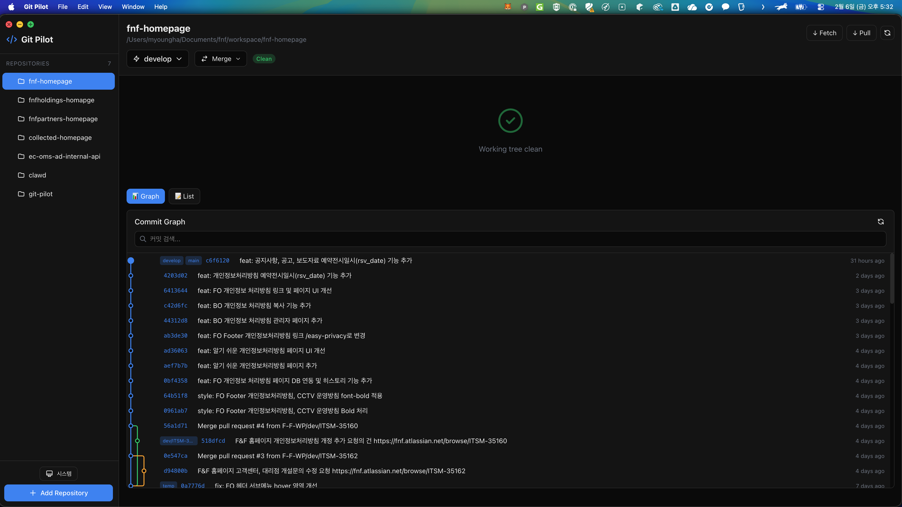

# Git Pilot 🚀

Git 저장소를 시각적으로 관리하는 macOS 데스크톱 앱



## ✨ 기능

- **커밋 그래프** - 브랜치와 커밋 히스토리를 시각적으로 확인
- **브랜치 관리** - 생성, 체크아웃, 삭제, 병합
- **커밋 상세** - 변경된 파일 및 diff 확인
- **다크 테마** - 눈이 편한 다크 모드
- **자동 업데이트 알림** - 새 버전 출시 시 알림

## 📥 설치 방법

### 1. 다운로드
[Releases 페이지](https://github.com/lee-m-h/git-pilot/releases)에서 최신 DMG 파일 다운로드

### 2. 설치
1. 다운로드한 `Git Pilot-x.x.x-arm64.dmg` 파일 더블클릭
2. Git Pilot 앱을 **Applications** 폴더로 드래그
3. DMG 창 닫기

### 3. 첫 실행
⚠️ 처음 실행할 때 "확인되지 않은 개발자" 경고가 뜰 수 있습니다.

**해결 방법:**
1. Applications에서 Git Pilot 앱을 **우클릭**
2. **"열기"** 선택
3. 경고창에서 **"열기"** 클릭

이후에는 정상적으로 실행됩니다.

## ⚙️ 요구사항

- **macOS** (Apple Silicon / M1, M2, M3...)
- **Node.js** 설치 필요 ([다운로드](https://nodejs.org/))

## 🔄 업데이트

앱 실행 시 자동으로 새 버전을 확인합니다.
새 버전이 있으면 알림이 표시되고, 다운로드 페이지로 이동할 수 있습니다.

수동 확인: **Git Pilot 메뉴 > 업데이트 확인...**

## 🛠️ 개발 환경 설정

```bash
# 저장소 클론
git clone https://github.com/lee-m-h/git-pilot.git
cd git-pilot

# 의존성 설치
npm install

# 개발 서버 실행
npm run dev

# 다른 터미널에서 Electron 실행
npm run electron:dev
```

## 📦 빌드

```bash
# macOS DMG 빌드
npm run electron:build
```

빌드된 파일: `dist/Git Pilot-x.x.x-arm64.dmg`

## 📄 라이선스

MIT License

---

Made with ❤️ by [@lee-m-h](https://github.com/lee-m-h)
